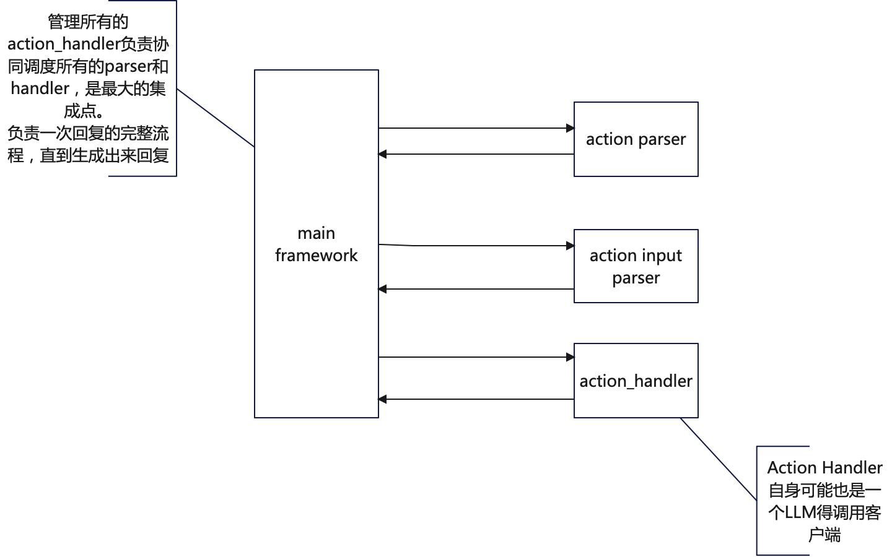

## 说明
看着《yandere ai girlfriend》的游戏视频，觉得这个游戏是个不错的小练习，就做了一个简化山寨版。

做的过程中发现哪怕是这个简化版也是个很有意思的实验程序，可以实验使用大语言模型的各种机制和模式

## 设计



这里面 reply_once 扮演 main_framework 。

## 运行

```shell
pip install -r requirements.txt

OPENAI_API_KEY=<your_api_key_here> python app.py
```

## 目前试验的机制或模式有

- [x] 由prompt控制主流程
- [x] 自定义的写死的ReAct Prompt
- [x] 在某一个Action中再次调用LLM
- [x] 状态保持
- [x] 状态改变
- [x] 对话记录的保持和改变
- [x] Action 之间传参
- [x] 结果校验，不合适就重新生成
- [x] 重试最大值，避免无线消耗
- [x] 不同的场景访问LLM采用差异的参数和公用的参数（有的有stop，有的没有，但公用温度）

## 还可以考虑尝试的试验

- [ ] 多个LLM并行执行，再由一个LLM打分，判断哪一个好的机制，进一步避免出现错误答案和较慢的情况。
- [ ] 结束的机制也交由一个专门的Prompt处理，主逻辑只做抽象过程，避免失焦
- [ ] 三个不同的状态改变，由prompt选择任意零到三个，可以动态生成多步Action并最终归纳为一个输出（这个不能放到主干prompt里）
- [ ] 展示状态、状态变化和每句话做决策的理由
- [ ] 引入多个虚拟人，可以看看当一个人跟多个机器人对话的时候会不会混淆。（可以设计一个迷宫游戏，根据多个角色对话解决问题）
- [ ] 除了对话，再加入动作
- [ ] 纯游戏向实验：加入一个主干剧情，逼迫剧情发展